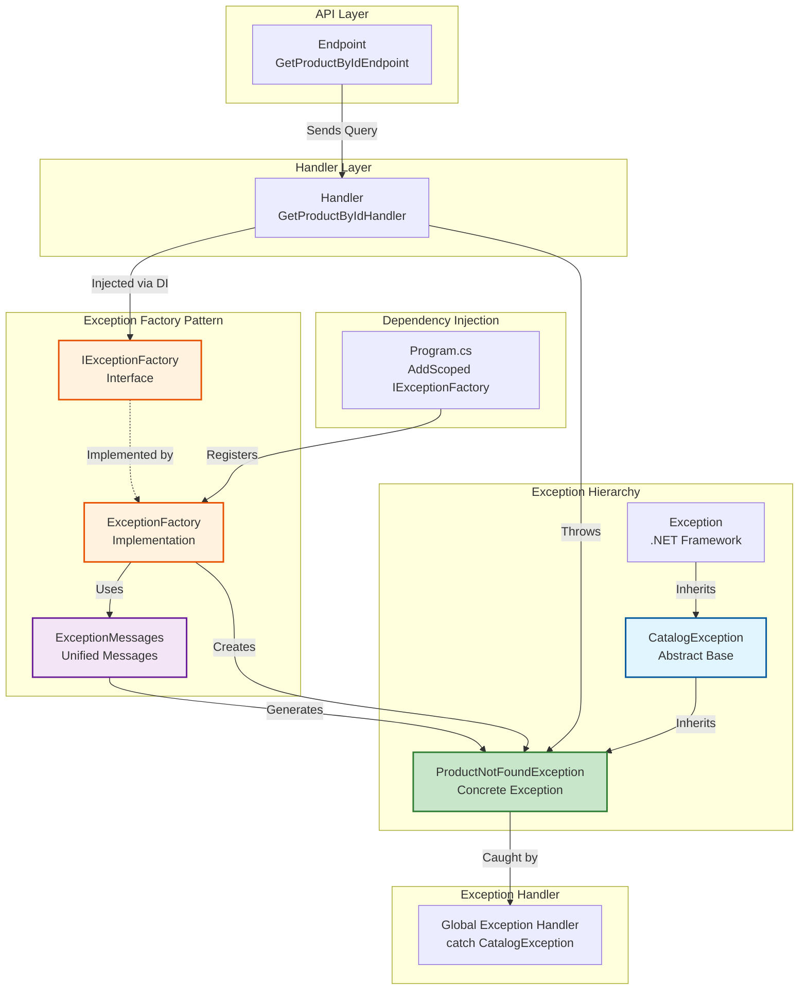
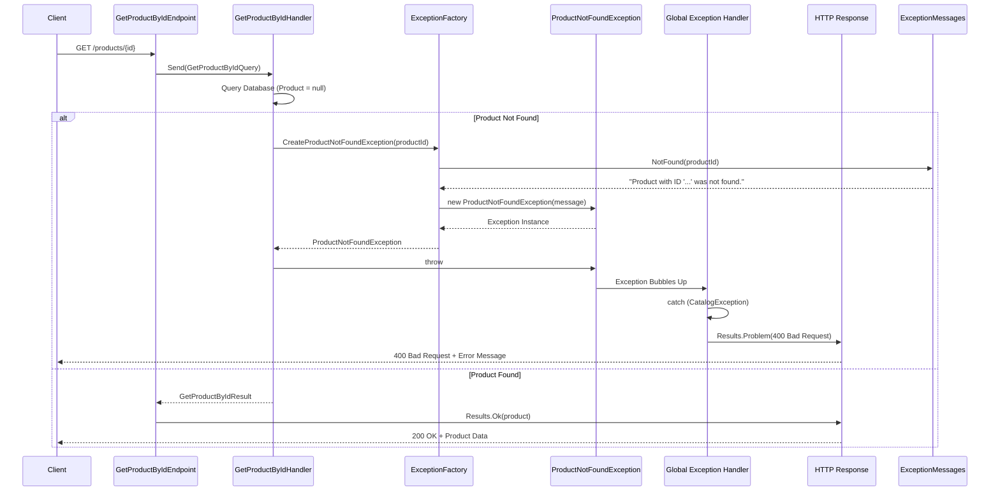
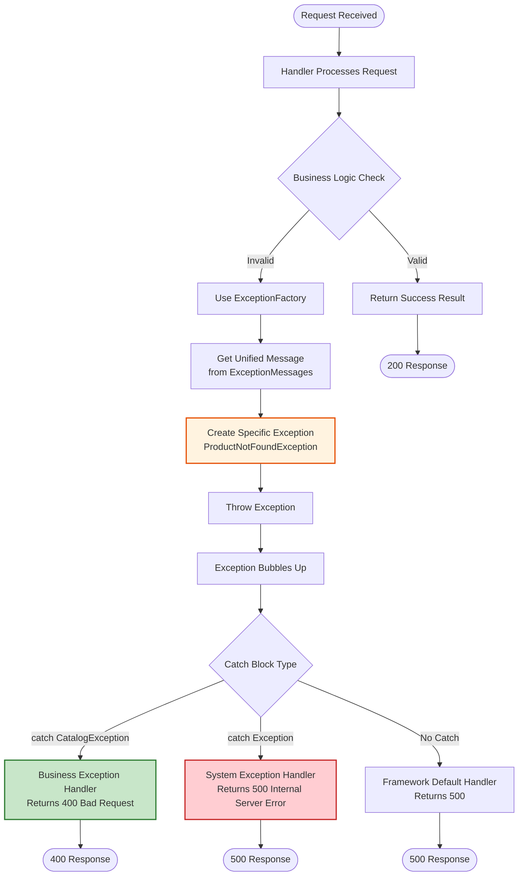
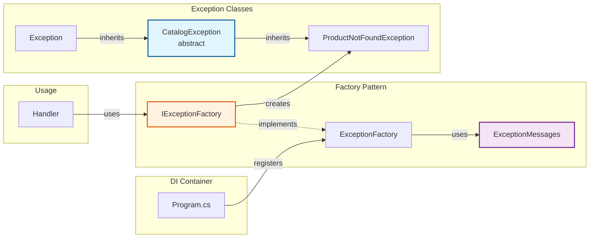
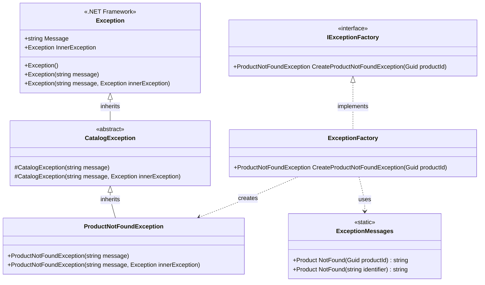

# Exception Factory Pattern

This folder contains the exception handling implementation using the Factory Design Pattern for the Catalog API.

## Overview

Instead of directly instantiating exceptions throughout the codebase, we use an exception factory pattern that provides a centralized way to create exceptions. This approach offers better testability, maintainability, and separation of concerns.

## Visual Diagram Overview

### Architecture Overview



### Sequence Diagram - Exception Flow



### Exception Handling Flow Chart



### Component Relationships



### Key Points from Diagrams

1. **Dependency Injection**: `ExceptionFactory` is registered in `Program.cs` and injected into handlers
2. **Factory Pattern**: Handlers use `IExceptionFactory` interface, not concrete exception classes
3. **Unified Messages**: `ExceptionMessages` class centralizes all exception message templates for consistency
4. **Context-Based Creation**: Factory methods accept context (e.g., product ID) instead of raw messages
5. **Exception Hierarchy**: All catalog exceptions inherit from `CatalogException`, which inherits from `Exception`
6. **Exception Handling**: Global handlers catch `CatalogException` for business errors (400) vs `Exception` for system errors (500)
7. **Flow**: Request → Handler → Factory → ExceptionMessages → Exception → Global Handler → HTTP Response

## Folder Structure

The Exceptions folder is organized into logical subfolders for better maintainability:

```
Exceptions/
├── Base/
│   └── CatalogException.cs          # Abstract base exception class
├── Types/
│   └── ProductNotFoundException.cs   # Specific exception types
├── Messages/
│   └── ExceptionMessages.cs         # Unified exception messages
├── Factory/
│   ├── IExceptionFactory.cs         # Factory interface
│   └── ExceptionFactory.cs          # Factory implementation
└── README.md                         # Documentation
```

### Folder Organization

- **`Base/`**: Contains the abstract base exception class (`CatalogException`)
- **`Types/`**: Contains specific exception types (e.g., `ProductNotFoundException`)
- **`Messages/`**: Contains centralized exception message templates
- **`Factory/`**: Contains the factory interface and implementation

## Structure

### `Base/CatalogException.cs`

- **Abstract base class** for all catalog-related exceptions
- Located in `Base/` folder for base exception types
- Inherits from `Exception`
- Provides constructors for message-only and message with inner exception scenarios
- Cannot be instantiated directly - must be inherited by specific exception types

#### Why Do We Need CatalogException?

Having a base `CatalogException` class provides several important benefits:

1. **Centralized Exception Handling**: You can catch all catalog-related exceptions at once in global exception handlers:

   ```csharp
   catch (CatalogException ex)
   {
       // Handle all catalog business exceptions (ProductNotFound, ProductAlreadyExists, etc.)
       return Results.Problem(ex.Message, statusCode: 400);
   }
   catch (Exception ex)
   {
       // Handle system/unexpected exceptions differently (500 error)
       return Results.Problem("An error occurred", statusCode: 500);
   }
   ```

2. **Separation of Concerns**: Distinguishes between:

   - **Business/Validation Exceptions** (CatalogException) → Usually return 400 Bad Request
   - **System/Technical Exceptions** (Exception) → Usually return 500 Internal Server Error

3. **Consistent Structure**: All catalog exceptions share the same base structure and can be extended with common properties if needed in the future (e.g., ErrorCode, Timestamp)

4. **API Identification**: Makes it immediately clear which exceptions originate from the Catalog API domain vs other services or system exceptions

5. **Future Extensibility**: Allows you to add common behavior to all catalog exceptions later (logging, error codes, etc.) without modifying each individual exception class

## Class Diagram



### Diagram Explanation

- **Exception**: Base .NET Framework class (shown for context)
- **CatalogException**: Abstract base class for all catalog domain exceptions (cannot be instantiated)
- **ProductNotFoundException**: Concrete exception class for product not found scenarios
- **ExceptionMessages**: Static class containing centralized, unified exception message templates
- **IExceptionFactory**: Interface defining the contract for exception creation
- **ExceptionFactory**: Concrete implementation that creates exception instances

The diagram shows:

- **Inheritance**: `Exception` → `CatalogException` → `ProductNotFoundException`
- **Implementation**: `ExceptionFactory` implements `IExceptionFactory`
- **Message Generation**: `ExceptionFactory` uses `ExceptionMessages` to build unified messages
- **Dependency**: `ExceptionFactory` creates instances of `ProductNotFoundException` with unified messages

### `Types/ProductNotFoundException.cs`

- **Specific exception** for when a product cannot be found
- Located in `Types/` folder for concrete exception types
- Inherits from `CatalogException`
- Used when querying for a product that doesn't exist in the database

### `Messages/ExceptionMessages.cs`

- **Centralized message definitions** for all catalog exceptions
- Located in `Messages/` folder for exception message templates
- Ensures consistent and unified error messages across the application
- Contains static methods that generate messages from context (e.g., product ID)
- Messages are defined once and reused throughout the application
- Example: `ExceptionMessages.Product.NotFound(productId)` → `"Product with ID '{productId}' was not found."`

### `Factory/IExceptionFactory.cs`

- **Interface** defining the contract for exception creation
- Located in `Factory/` folder for factory-related interfaces
- Contains factory methods for creating different exception types
- Methods accept context (e.g., IDs) rather than raw messages for unification
- Currently includes:
  - `CreateProductNotFoundException(Guid productId)`

### `Factory/ExceptionFactory.cs`

- **Concrete implementation** of `IExceptionFactory`
- Located in `Factory/` folder for factory implementations
- Implements all factory methods to create appropriate exception instances
- **Builds unified messages** using `ExceptionMessages` class before creating exceptions
- Registered as a scoped service in dependency injection container

## Usage

### In Handlers/Services

Instead of:

```csharp
// ❌ Bad: Inconsistent messages, no centralization
throw new ProductNotFoundException("Product doesn't exist.");
throw new ProductNotFoundException("Product not found.");
throw new ProductNotFoundException("Could not find product.");
```

Use:

```csharp
// ✅ Good: Unified message, passes context (product ID)
throw exceptionFactory.CreateProductNotFoundException(productId);
```

**Benefits of this approach:**

- **Unified Messages**: All `ProductNotFoundException` instances use the same message format
- **Context-Aware**: Messages include relevant context (e.g., product ID) automatically
- **Maintainable**: Change message format in one place (`ExceptionMessages.cs`)
- **Consistent**: No more variation in exception messages across developers

### Dependency Injection

The factory is registered in `Program.cs`:

```csharp
builder.Services.AddScoped<IExceptionFactory, ExceptionFactory>();
```

Inject `IExceptionFactory` into your handlers or services via constructor injection:

```csharp
internal class GetProductByIdHandlerQuery(
    IDocumentStore store,
    IExceptionFactory exceptionFactory)
    : IQueryHandler<GetProductByIdQuery, GetProductByIdResult>
{
    // Use exceptionFactory.CreateProductNotFoundException(...)
}
```

## Benefits

1. **Decoupling**: Handlers don't need to know about specific exception types
2. **Testability**: Easy to mock `IExceptionFactory` in unit tests
3. **Centralized Logic**: Exception creation logic is in one place
4. **Unified Messages**: All exception messages are centralized and consistent across the application
5. **Context-Aware**: Messages automatically include relevant context (e.g., IDs, identifiers)
6. **Maintainability**: Change exception message formats in one place (`ExceptionMessages.cs`)
7. **Extensibility**: Easy to add new exception types by extending the factory
8. **Type Safety**: Factory methods ensure correct exception types are used

## Adding New Exceptions

To add a new exception type:

1. Create a new exception class inheriting from `CatalogException` in the `Types/` folder:

   ```csharp
   // File: Types/ProductAlreadyExistsException.cs
   namespace Catalog.API.Exceptions;

   public class ProductAlreadyExistsException : CatalogException
   {
       public ProductAlreadyExistsException(string message) : base(message) { }
   }
   ```

2. Add a unified message method to `Messages/ExceptionMessages.cs`:

   ```csharp
   public static class Product
   {
       public static string AlreadyExists(string productName)
           => $"Product with name '{productName}' already exists.";
   }
   ```

3. Add a factory method to `Factory/IExceptionFactory.cs`:

   ```csharp
   ProductAlreadyExistsException CreateProductAlreadyExistsException(string productName);
   ```

4. Implement the method in `Factory/ExceptionFactory.cs`:

   ```csharp
   public ProductAlreadyExistsException CreateProductAlreadyExistsException(string productName)
   {
       var message = ExceptionMessages.Product.AlreadyExists(productName);
       return new ProductAlreadyExistsException(message);
   }
   ```

5. Use it in your handlers:
   ```csharp
   throw exceptionFactory.CreateProductAlreadyExistsException(product.Name);
   ```
