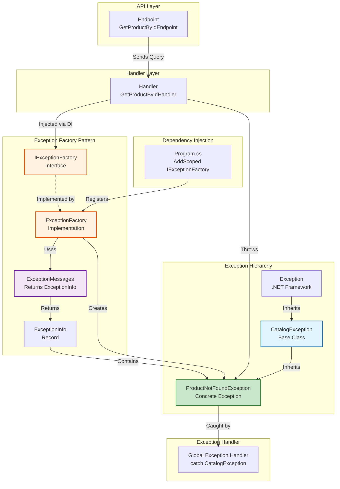
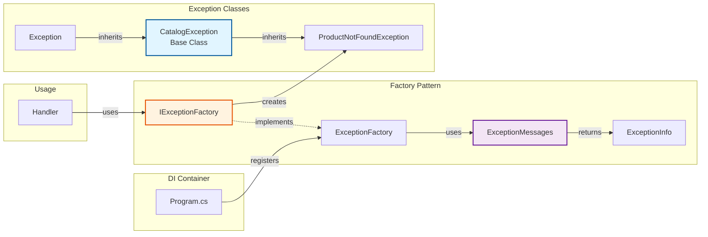
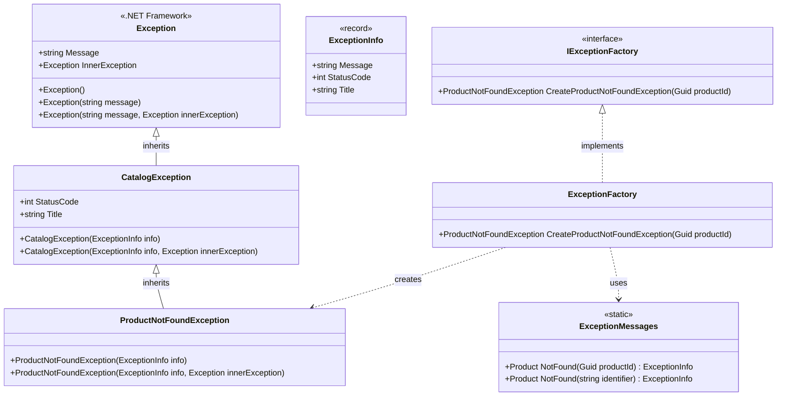

# Exception Factory Pattern

This folder contains the exception handling implementation using the Factory Design Pattern for the Catalog API.

## Overview

Instead of directly instantiating exceptions throughout the codebase, we use an exception factory pattern that provides a centralized way to create exceptions. This approach offers better testability, maintainability, and separation of concerns.

## Visual Diagram Overview

### Architecture Overview



### Sequence Diagram - Exception Flow

```mermaid
sequenceDiagram
    participant Client
    participant Endpoint as GetProductByIdEndpoint
    participant Handler as GetProductByIdHandler
    participant Factory as ExceptionFactory
    participant Exception as ProductNotFoundException
    participant GlobalHandler as Global Exception Handler
    participant Response as HTTP Response

    Client->>Endpoint: GET /products/{id}
    Endpoint->>Handler: Send(GetProductByIdQuery)

    Handler->>Handler: Query Database (Product = null)

    alt Product Not Found
        Handler->>Factory: CreateProductNotFoundException(productId)
        Factory->>ExceptionMessages: NotFound(productId)
        ExceptionMessages-->>Factory: ExceptionInfo (message, statusCode, title)
        Factory->>Exception: new ProductNotFoundException(ExceptionInfo)
        Exception-->>Factory: Exception Instance
        Factory-->>Handler: ProductNotFoundException
        Handler->>Exception: throw
        Exception->>GlobalHandler: Exception Bubbles Up

        GlobalHandler->>GlobalHandler: catch (CatalogException)
        GlobalHandler->>Response: Uses exception.StatusCode and exception.Title
        Response-->>Client: 404 Not Found + Error Message
    else Product Found
        Handler-->>Endpoint: GetProductByIdResult
        Endpoint->>Response: Results.Ok(product)
        Response-->>Client: 200 OK + Product Data
    end
```



### Exception Handling Flow Chart


### Component Relationships



### Key Points from Diagrams

1. **Dependency Injection**: `ExceptionFactory` is registered in `Program.cs` and injected into handlers
2. **Factory Pattern**: Handlers use `IExceptionFactory` interface, not concrete exception classes
3. **Unified Exception Data**: `ExceptionMessages` class centralizes all exception information (message, status code, title) for consistency
4. **Context-Based Creation**: Factory methods accept context (e.g., product ID) instead of raw messages
5. **Exception Hierarchy**: All catalog exceptions inherit from `CatalogException`, which inherits from `Exception`
6. **Exception Handling**: Global middleware catches `CatalogException` and uses its `StatusCode` and `Title` properties for HTTP responses
7. **Flow**: Request → Handler → Factory → ExceptionMessages (returns ExceptionInfo) → Exception → Global Handler → HTTP Response
8. **Simplified Structure**: `ExceptionInfo` record reduces boilerplate by bundling message, status code, and title together

## Folder Structure

The Exceptions folder is organized into logical subfolders for better maintainability:

```
Exceptions/
├── Base/
│   └── CatalogException.cs          # Base exception class with HTTP info
├── ExceptionInfo.cs                  # Record containing message, statusCode, and title
├── Types/
│   └── ProductNotFoundException.cs   # Specific exception types
├── Messages/
│   └── ExceptionMessages.cs         # Returns ExceptionInfo (message, statusCode, title)
├── Factory/
│   ├── IExceptionFactory.cs         # Factory interface
│   └── ExceptionFactory.cs          # Factory implementation
└── README.md                         # Documentation
```

### Folder Organization

- **`Base/`**: Contains the base exception class (`CatalogException`) with HTTP response information
- **`ExceptionInfo.cs`**: Record containing message, status code, and title for exceptions
- **`Types/`**: Contains specific exception types (e.g., `ProductNotFoundException`)
- **`Messages/`**: Contains centralized exception definitions that return `ExceptionInfo` (message, status code, and title)
- **`Factory/`**: Contains the factory interface and implementation

## Structure

### `ExceptionInfo.cs`

- **Record** containing all information needed for an exception and its HTTP response
- Contains: `Message`, `StatusCode`, and `Title`
- Used by `ExceptionMessages` to return complete exception information
- Simplifies exception creation by bundling all related data together

### `Base/CatalogException.cs`

- **Base class** for all catalog-related exceptions
- Located in `Base/` folder for base exception types
- Inherits from `Exception`
- Contains `StatusCode` and `Title` properties for HTTP responses
- Takes `ExceptionInfo` in constructors to initialize all properties
- Can be used directly or inherited by specific exception types

#### Why Do We Need CatalogException?

Having a base `CatalogException` class provides several important benefits:

1. **Centralized Exception Handling**: You can catch all catalog-related exceptions at once in global exception handlers:

   ```csharp
   catch (CatalogException ex)
   {
       // Handle all catalog business exceptions (ProductNotFound, ProductAlreadyExists, etc.)
       // Uses the StatusCode and Title from the exception itself
       return Results.Problem(
           detail: ex.Message,
           statusCode: ex.StatusCode,
           title: ex.Title);
   }
   catch (Exception ex)
   {
       // Handle system/unexpected exceptions differently (500 error)
       return Results.Problem("An error occurred", statusCode: 500);
   }
   ```

2. **Separation of Concerns**: Distinguishes between:

   - **Business/Validation Exceptions** (CatalogException) → Return appropriate status codes (404, 400, etc.) defined in ExceptionMessages
   - **System/Technical Exceptions** (Exception) → Return 500 Internal Server Error

3. **Consistent Structure**: All catalog exceptions share the same base structure and can be extended with common properties if needed in the future (e.g., ErrorCode, Timestamp)

4. **API Identification**: Makes it immediately clear which exceptions originate from the Catalog API domain vs other services or system exceptions

5. **Future Extensibility**: Allows you to add common behavior to all catalog exceptions later (logging, error codes, etc.) without modifying each individual exception class

## Class Diagram



### Diagram Explanation

- **Exception**: Base .NET Framework class (shown for context)
- **ExceptionInfo**: Record containing message, status code, and title for exceptions
- **CatalogException**: Base class for all catalog domain exceptions with HTTP response information
- **ProductNotFoundException**: Concrete exception class for product not found scenarios
- **ExceptionMessages**: Static class returning `ExceptionInfo` with complete exception data
- **IExceptionFactory**: Interface defining the contract for exception creation
- **ExceptionFactory**: Concrete implementation that creates exception instances

The diagram shows:

- **Inheritance**: `Exception` → `CatalogException` → `ProductNotFoundException`
- **Implementation**: `ExceptionFactory` implements `IExceptionFactory`
- **Data Flow**: `ExceptionMessages` returns `ExceptionInfo` → `ExceptionFactory` uses it → Creates exceptions
- **Dependency**: `ExceptionFactory` creates instances using `ExceptionInfo` from `ExceptionMessages`

### `Types/ProductNotFoundException.cs`

- **Specific exception** for when a product cannot be found
- Located in `Types/` folder for concrete exception types
- Inherits from `CatalogException`
- Takes `ExceptionInfo` in constructors
- Used when querying for a product that doesn't exist in the database

### `Messages/ExceptionMessages.cs`

- **Centralized exception definitions** for all catalog exceptions
- Located in `Messages/` folder for exception definitions
- Returns `ExceptionInfo` containing message, status code, and title
- Ensures consistent and unified error responses across the application
- Contains static methods that generate complete exception information from context (e.g., product ID)
- All exception metadata (message, status code, title) is defined in one place
- Example: `ExceptionMessages.Product.NotFound(productId)` → Returns `ExceptionInfo` with:
  - Message: `"Product with ID '{productId}' was not found."`
  - StatusCode: `404`
  - Title: `"Product Not Found"`

### `Factory/IExceptionFactory.cs`

- **Interface** defining the contract for exception creation
- Located in `Factory/` folder for factory-related interfaces
- Contains factory methods for creating different exception types
- Methods accept context (e.g., IDs) rather than raw messages for unification
- Currently includes:
  - `CreateProductNotFoundException(Guid productId)`

### `Factory/ExceptionFactory.cs`

- **Concrete implementation** of `IExceptionFactory`
- Located in `Factory/` folder for factory implementations
- Implements all factory methods to create appropriate exception instances
- Gets `ExceptionInfo` from `ExceptionMessages` and passes it to exception constructors
- Simple and clean - just retrieves exception info and creates the exception
- Registered as a scoped service in dependency injection container

## Usage

### In Handlers/Services

Instead of:

```csharp
// ❌ Bad: Inconsistent messages, no centralization
throw new ProductNotFoundException("Product doesn't exist.");
throw new ProductNotFoundException("Product not found.");
throw new ProductNotFoundException("Could not find product.");
```

Use:

```csharp
// ✅ Good: Unified message, passes context (product ID)
throw exceptionFactory.CreateProductNotFoundException(productId);
```

**Benefits of this approach:**

- **Unified Responses**: All `ProductNotFoundException` instances use the same message, status code, and title
- **Context-Aware**: Messages include relevant context (e.g., product ID) automatically
- **Maintainable**: Change message, status code, or title in one place (`ExceptionMessages.cs`)
- **Consistent**: No more variation in exception responses across developers
- **Complete Information**: Exception contains all HTTP response data (status code, title, message)

### Dependency Injection

The factory is registered in `Program.cs`:

```csharp
builder.Services.AddScoped<IExceptionFactory, ExceptionFactory>();
```

Inject `IExceptionFactory` into your handlers or services via constructor injection:

```csharp
internal class GetProductByIdHandlerQuery(
    IDocumentStore store,
    IExceptionFactory exceptionFactory)
    : IQueryHandler<GetProductByIdQuery, GetProductByIdResult>
{
    // Use exceptionFactory.CreateProductNotFoundException(...)
}
```

## Benefits

1. **Decoupling**: Handlers don't need to know about specific exception types
2. **Testability**: Easy to mock `IExceptionFactory` in unit tests
3. **Centralized Logic**: Exception creation logic is in one place
4. **Unified Responses**: All exception data (message, status code, title) is centralized and consistent
5. **Context-Aware**: Messages automatically include relevant context (e.g., IDs, identifiers)
6. **Maintainability**: Change exception responses in one place (`ExceptionMessages.cs`)
7. **Extensibility**: Easy to add new exception types by extending the factory and messages
8. **Type Safety**: Factory methods ensure correct exception types are used
9. **Less Boilerplate**: Simple structure with `ExceptionInfo` record reducing code duplication
10. **HTTP-Aware**: Exceptions contain all HTTP response information (status code, title)

## Adding New Exceptions

To add a new exception type:

1. Add an exception definition method to `Messages/ExceptionMessages.cs`:

   ```csharp
   public static class Product
   {
       public static ExceptionInfo AlreadyExists(string productName) => new(
           Message: $"Product with name '{productName}' already exists.",
           StatusCode: StatusCodes.Status409Conflict,
           Title: "Product Already Exists"
       );
   }
   ```

2. Create a new exception class inheriting from `CatalogException` in the `Types/` folder:

   ```csharp
   // File: Types/ProductAlreadyExistsException.cs
   namespace Catalog.API.Exceptions;

   public class ProductAlreadyExistsException : CatalogException
   {
       public ProductAlreadyExistsException(ExceptionInfo info) : base(info) { }

       public ProductAlreadyExistsException(ExceptionInfo info, Exception innerException)
           : base(info, innerException) { }
   }
   ```

3. Add a factory method to `Factory/IExceptionFactory.cs`:

   ```csharp
   ProductAlreadyExistsException CreateProductAlreadyExistsException(string productName);
   ```

4. Implement the method in `Factory/ExceptionFactory.cs`:

   ```csharp
   public ProductAlreadyExistsException CreateProductAlreadyExistsException(string productName)
   {
       var exceptionInfo = ExceptionMessages.Product.AlreadyExists(productName);
       return new ProductAlreadyExistsException(exceptionInfo);
   }
   ```

5. Use it in your handlers:
   ```csharp
   throw exceptionFactory.CreateProductAlreadyExistsException(product.Name);
   ```

**Note**: The exception will automatically return the correct HTTP status code (409 Conflict) and title when caught by the global exception handler middleware.
